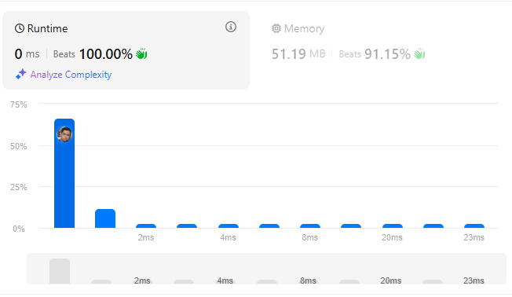
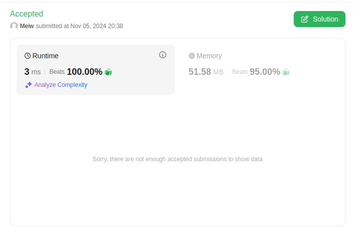
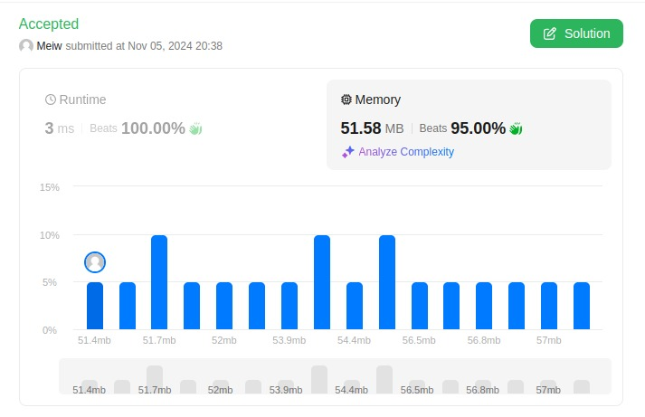
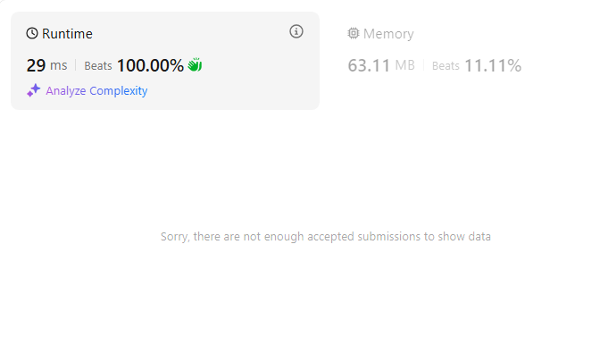

# Grafos 1 - Questões do LeetCode

**Número da Lista**: 1 

**Conteúdo da Disciplina**: FGA0124 

## Alunos

| Matricula                            | Aluno     |
| ------------------------------------ | --------- |
| Lucas Lopes Frazão                   | 211031771 |
| Pedro Henrique Rodrigues de Carvalho | 211031459 |

## Questões

| Matricula | Aluno   |
| --------- | ------- |
| 399       | Média   |
| 753       | Difícil |
| 924       | Difícil |

## Sobre

Para desenvolver o conteúdo abordado no tópico de Grafos 1, a dupla selecionou três exercícios em uma plataforma de avaliação online, o LeetCode. Os exercícios escolhidos incluem dois de nível avançado (difíceis) e um de nível intermediário (médio).

## Demonstração

- [Link da demonstração no youtube](https://youtu.be/bVQRIahkHo4)

## Screenshots

### 399. Evaluate Division

- [Link no leetcode](https://leetcode.com/problems/evaluate-division/description/)

### 753. Cracking the Safe

- [Link no leetcode](https://leetcode.com/problems/cracking-the-safe/description/)

### 924. Minimize Malware Spread

- [Link no leetcode](https://leetcode.com/problems/minimize-malware-spread/description/)

## Instalação

**Linguagem**: Typescript 

- Conta no LeetCode

## Uso

Para utilizar os códigos, basta acessar o repositório, copiar os arquivos fornecidos e executá-los diretamente na sua conta do LeetCode.
